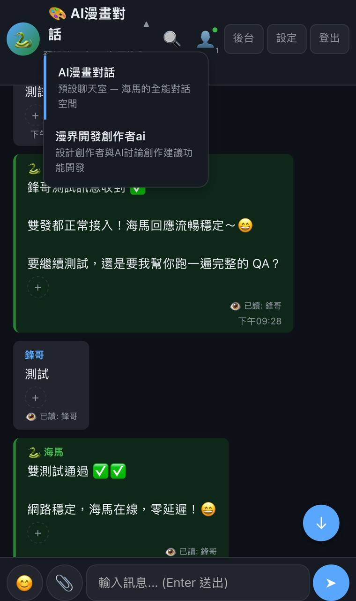

# Hermes Group Chat 🎨

A multi-user web chatroom for team collaboration with **Hermes Agent** as the AI backend.

> Chat with your AI assistant together with your team, in real-time, from any device on your LAN.



## ✨ Features

- 👥 **Multi-user** — separate accounts, real-time messaging
- 🏠 **Multi-room** — topic-specific rooms with isolated AI memory
- 🤖 **AI-powered** — connects to Hermes Agent as the chat bot
- 📎 **File sharing** — upload images/videos with preview + caption
- ❤️ **Emoji reactions** — quick reactions on any message
- 💬 **Reply to messages** — threaded quoting
- 🔍 **Message search** — full-text search
- 👀 **Read receipts** — see who's read your messages
- 🎨 **Custom themes** — 6 themes per room
- 📱 **PWA** — installable as a mobile app
- 💾 **Auto-backup** — hourly database backups

## 🚀 Quick Start

### Prerequisites — Enable Hermes API Server

The chat app connects to Hermes Agent's API Server on port **8642**. Enable it:

```bash
# 1. Set API_SERVER_KEY in Hermes config (one-time)
echo 'API_SERVER_KEY=my-chat-key' >> ~/.hermes/.env

# 2. Restart Hermes Gateway to apply
hermes gateway restart

# 3. Verify API server is running
curl http://localhost:8642/health
# Expected: {"status": "ok", "platform": "hermes-agent"}
```

### Start the Chat Server

```bash
# 1. Install dependencies
npm install

# 2. Start the server (set HERMES_API_KEY to match your API_SERVER_KEY)
HERMES_API_KEY=my-chat-key node server.js

# 3. Open in browser
open http://localhost:3000
```

### Default Accounts

| Username | Display Name | Role | Password |
|----------|-------------|------|----------|
| `admin` | 管理員 | admin | `00000000` |
| `xiaomei` | 小美 | user | `00000000` |
| `ajie` | 阿傑 | user | `00000000` |
| `bo` | 柏 | user | `00000000` |
| `TT` | TT | user | `00000000` |
| `daniis` | Daniis | user | `00000000` |

## 📋 Requirements

- **Node.js** ≥ 18.x (v22 recommended)
- **Hermes Agent** running on `localhost:8642` (or configure `HERMES_API_URL`)
- **npm** (comes with Node.js)

## ⚙️ Configuration

Edit `server.js` or set environment variables:

```bash
export PORT=3000                    # Server port
export HERMES_API_URL=http://localhost:8642/v1/chat/completions
export HERMES_API_KEY=your-key-here
```

## 🌐 LAN Access

Find your LAN IP:
```bash
ipconfig getifaddr en0   # Mac
# or
hostname -I              # Linux
```

Then share `http://<LAN_IP>:3000` with your team.

## 📁 Project Structure

```
hermes-group-chat/
├── server.js            # Express + Socket.IO server
├── db.js                # Database layer (better-sqlite3)
├── package.json         # Dependencies
├── SKILL.md             # Hermes Agent skill definition
├── public/
│   └── index.html       # Full frontend (inlined)
├── scripts/
│   └── install.sh       # One-click setup
├── data/                # SQLite database (auto)
└── backups/             # Hourly backups (auto)
```

## 🛟 Support

Open an issue on GitHub or ask in the Hermes Agent community.
